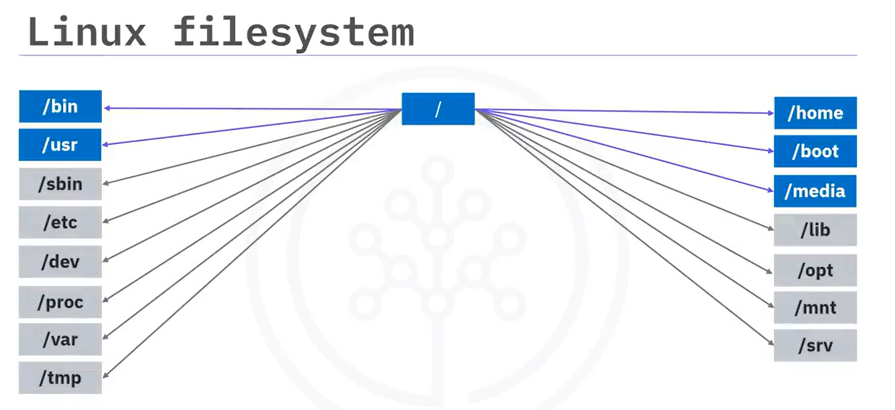
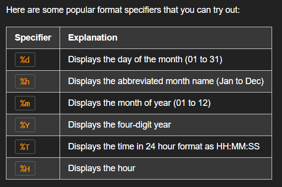
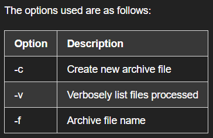

# Course Overview
The course is structured into 4 weeks, each focusing on a specific topics described as below.

## Module 1. Introduction to Linux

Unix is a family of operating systems dating from the 1960s Linux was originally developed in 1991 as a free, open-source alternative to Unix Linux is multi-user, portable, and supports multitasking And Linux is widely used today in mobile devices, supercomputers, data centers, and cloud servers

### Overview of Linux Archtecture

- UI

    The UI allows users to perform tasks by controlling applications with the keyboard.
    Desktop versions of Linux include a Graphical User Interface, or GUI layer, which is similar to Microsoft Windows. This extends the UI functionality to other control devices, such as a mouse. You might use a Linux machine to: Use a web browser to send your friend an email.

- Application

    Or use a music player to listen to your favorite song. Applications are the software that enables a user to perform a task in a Linux system. Applications can include the following: System tools, such as compilers. Programming languages.

    - System Daemons
    - Shells, which are special applications that are often part of the operating system itself. And user apps, which can be any kind of applications, from browsers, to text editors, to games.
    - User Apps
    - Tools
- Operating System
    The operating system controls the jobs and programs that are vital to system health and stability. Its functions also include: Assigning software to users, Detecting errors and implementing measures to prevent complete system failures, And performing file management. In a Linux system, the operating system is built on top of the Linux kernel, which performs the most vital operations.
- Kernel
    The kernel is the lowest-level software in a Linux system and has complete control of the system. It starts as soon as your computer boots and remains in your computer’s memory while the system is running. It also acts as a bridge between your apps and your machine hardware, enabling the two to communicate effectively using "system calls."
    The kernel has four key jobs: Memory management, Process management, Managing device drivers for proper hardware support, And assuring the system remains secure
- Hardware
    hardware, consisting of the physical or electronic devices that make up your computer. This layer can include the following: The central processing unit, or CPU, which is responsible for executing most calculations. The random access memory, or RAM, which is a fast storage unit used to hold the temporary information your applications need to run. Storage for data that needs to persist when your computer is powered off. Your computer's screen. And any USB devices such as a keyboard, mouse, or USB drive. The Linux filesystem is the collection of files on your machine. It includes the files needed to run the machine and applications as well as your own files containing your work.

    


### Browsing and navigating directories
#### Special paths
- Symbol represents path to
>
    ~	home directory
    /	root directory
    .	present working directory
    ..	parent of present working directory

## Module 2. Introduction to Linux Commands

### Informational Commands

```whoami``` - this command to return your current username.

```uname -a``` - this command will print all the system information.

- Kernel name
- Network node hostname
- Kernel release date
- Kernel version
- Machine hardware name
- Hardware platform
- Operating system

```id``` - This command displays the user id and group id information of the current user.


```df -h``` - This command will display available disk space in a "human-readable" format

```ps -e``` - This command lists each process that is currently running and its PID (process id). This command includes processes owned by other users.

```echo``` - This command displays the given text on the screen.

```date``` - This command will print the data in terminal




### Navigate in file system

```ls``` - List the files and directories

```pwd``` - Get current working directory

```cd``` - Change the working directory

```find . -name "file_name.ext"``` - Find files in a directory tree

```mkdir``` - Create directory

```rm``` - Remove file or directory (add -r to remove a directory ```rm -r "directory_name"```)

```touch``` - Create an empty file ```touch file.txt```. If you use touch with an already existent file, that file will be updated to the current data of operation.

```cp``` - Copy an file. Its possible to define the destine directory and the new name of the copy. To copy a directory is necessary to use -r similar to remove function. 

```mv``` - Move files to another directory

```chmod``` - Change file permissions

### Managing File Permissions and Ownership

# File Permissions and Ownership in Linux

## Why do we need file permissions and ownership?

Linux is a multi-user operating system. This means that by default, other users will be able to view any files you store on the system. However, you may have some files, such as your personal tax documents or your employer's intellectual property documents, that are private or confidential. How can you protect these sensitive documents from being viewed or modified by others?

## File ownership and permissions

There are three possible levels of file ownership in Linux: user, group, and other.

Whoever creates a file, namely the user at the time of creation, becomes the owner of that file by default. A group of users can also share ownership of a file. The other category essentially refers to anyone in the universe with access to your Linux machine - Exercise caution when assigning ownership permission to this level!

Only an official owner of a file is allowed to change its permissions. This means that only owners can decide who can read the file, write to it, or execute it.

## Viewing file permissions

Let's say you've entered the following lines of code:

```bash
echo "Who can read this file?" > my_new_file
more my_new_file
ls -l my_new_file
```

Here we've echoed the string "Who can read this file?" into a new file called my_new_file. The next line uses the more command to print the contents of the new file. Finally, the ls command with the -l option displays the file's (default) permissions: `rw-r--r--`

The first three characters (rw-) define the user permissions, the next three (r--) the group permissions, and the final three (r--) the other permissions.

So you, being the user, have the permission rw-, which means you have read and write permissions by default, but do not have execution permissions. Otherwise, there would be an x in place of the last -.

Thus by looking at the entire line, rw-r--r--, you can see that anyone can read the file, nobody can execute it, and you are the only user that can write to it.

**Note:** The - at the very beginning of the line in the terminal means that the permissions are referring to a file. If you were getting the permissions to a directory, you would see a d in the front for "directory".

## Directory permissions

The permissions for directories are similar but distinct for files. Though directories use the same rwx format, the symbols have slightly different meanings.

The following table illustrates the meanings of each permission for directories:

| Directory Permission | Permissible action(s) |
|---------------------|----------------------|
| r | List directory contents using ls command |
| w | Add or remove files or directories |
| x | Enter directory using cd command |

Setting appropriate permissions on directories is a best practice for both security and stability reasons. Though this reading focuses on security, you will learn more about other reasons for setting file permissions and ownership later in this course.

## Making a file private

You can revoke read permissions from your group and all other users by using the chmod command. Ensure successful modification by using the ls -l command again:

```bash
chmod go-r my_new_file
ls -l my_new_file
-rw------- 1 theia users 24 Dec 22 18:49 my_new_file
```

In the chmod command, go-r is the permission change to be applied, which in this case means removing for the group (g) and others (o) the read (r) permission. The chmod command can be used with both files and directories.

Executable files - looking ahead
You've learned what it means to read or write to a file, but what does it mean to have permissions to execute a file in Linux?

A Linux file is executable if it contains instructions that can be directly interpreted by the operating system. Basically, an executable file is a ready-to-run program. They're also referred to as binaries or executables.

In this course, you will become very familiar with a particular kind of executable called a script, which is a program written in a scripting language. You'll learn all about shell scripting, or more specifically Bash scripting, which is writing scripts in Bash (Bourne Again Shell), a very popular shell scripting language. A shell script is a plain text file that can be interpreted by a shell.

Formally speaking, for a text file to be considered an executable shell script for a given user, it needs to have two things:

Execute permissions set for that user

A directive, called a "shebang", in its first line to declare itself to the operating system as a binary

All of this will become more clear to you soon when we get to the topic of shell scripting.

### Viewing File Content

```cat``` - (catenate)  Print the entire file content.

```more``` - Print file content page-by-page.

```head``` - Print first 10 lines of the file. If use -n can specify the quantity of lines that you want to show.

```tail``` - Print last 10 lines of the file. If use -n can specify the quantity of lines that you want to show.

```wc``` - Count the number of characters, words and lines.

### Useful Commands for Wrangling Text Files.”

```sort``` - This command sort line in the file.

```uniq``` - Filter out the repeat lines.

```grep``` - (global regular expression print) Return lines tha match some patter, like ```grep leo file.txt``` will find in the file sentences that match the search "leo".

```cut``` - Extract a section from each line

```paste``` - Merge lines of differente files.

### A Brief Introduction to Networking

Packets and Pings
A network packet is a formatted chunk of data that can be transmitted over a network.

Today's computer networks typically use communication protocols that are based on such packets of information. Every packet consists of two types of data: 1. the control information, and 2. the payload. The control information is data about how and where to deliver the payload, such as the source and destination network addresses, while the payload is the message being sent.

The ping command works by sending special 'echo request' packets to a host and waiting for a response from the host.

ping is a utility available on most operating systems that have networking capability. Linux has its own implementation of the ping command that's used to test and troubleshoot connectivity to other network hosts.

URLs and IP Adresses
IP stands for "Internet Protocol" which defines the format of data transmitted over the internet or a local network.

An IP address is a code used to uniquely identify any host on a network.

An IP address can be used to establish a connection to a host and exchange packets with it, for example using the ping command. In addition to their payload, IP packets - a type of network packet that conforms to the Internet Protocol - contain the IP addresses of the source and destination hosts.

A URL, more commonly known as a web address, stands for Uniform Resource Locator.

A URL uniquely identifies a web resource and enables access to that resource. Typically the resource that a URL points to is a web page, but it can also be used for tasks such as transferring files, sending emails, and accessing databases.

For example, the URL to the Wikipedia page for URL is https://en.wikipedia.org/wiki/URL. Just like for a typical URL, its format indicates a protocol (https), a hostname (en.wikipedia.org), and a file name (/wiki/URL).

### Network Commands

```hostname``` - This command shows the host name. If use -i we can get the IP. ```hostname -i```

```ip -a``` - This command display system network interface. 

```ping <site>``` - Ping sends packets, known as ICMP, Internet Control Message Protocol requests, To the server, listens for a response, And prints a result. Used to test server connection. 

```curl``` - The curl command is a powerful tool That enables you to transfer data to and from URLs And supports many different protocols.

```wget``` - Wget is like curl in that it can retrieve a file Located at a URL or the HTML code for a web page. But it's more specialized in its protocol support And has recursive downloading capabilities. This is useful when a URL might point to a folder That contains several files.

### Archiving and Compressing

```tar``` - (tape archive) Archive and extract files. 



```tar -cf notes.tar notes``` . If you would also like your archive to be compressed, you can enter the same command, except now you can use ```tar -czf notes.tar .gz notes``` that will use compression program called gzip. Adding the suffix dot gz to the output name ensures that Windows-based programs, for example, will correctly recognize the file type.

```tar -tf notes.tar``` - will list the files archive

```tar -xf notes.tar notes``` - That command will unpack or dearchive the archive files.

```tar -xf notes.tar .gz notes``` - Decompressing and extract files.

```zip``` - Compress files and directores to an archive. ```zip -r notes.zip notes```

```unzip``` = Extract and decompress zip archive. ```unzip notes.zip```

## Module 3. Introduction to Shell Scripting

## Module 4. Final Project and Final Exam

- Lesson 1. Practice Project

- Lesson 2. Final Project

- Lesson 3. Final Exam

